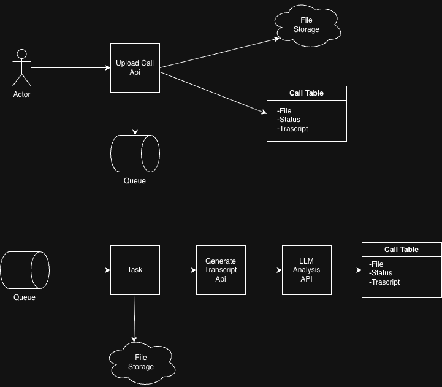

# Call Analyzer: Take-home Challenge

A full-stack Django application designed to process, transcribe, and analyze sales/support calls using state-of-the-art AI. This tool provides diarized transcripts, automated summaries, and intent-based tagging to help sales teams gain insights from their conversations.

## Try the App!
1.- Download a sample call from the "sample_files" folder

2.- access the [heroku app](https://altur-challenge-app-8d11da3e7c1b.herokuapp.com/) and add a file in the first section, dont forget to click "upload file" button

## Arquitecture


## 🚀 Key Features
- **Asynchronous Processing**: Uses Celery and Redis to handle calls up to 30 minutes long without blocking the UI.
- **High-Fidelity STT**: Integrated with **Deepgram (Nova-2)** for diarized transcription (Speaker 0 vs. Speaker 1).
- **LLM Analysis**: Powered by **Groq (Llama 3.1 8B)** for near-instant summaries and metadata tagging.
- **Unified Dashboard**: Real-time analytics showing intent distribution and processing metrics.
- **Export Capabilities**: Download full call records (metadata + transcript + analysis) as standardized JSON.
- **REST API**: Full programmatic access to list, view, and export calls.

---

## 🛠 Tech Stack
- **Backend**: Django 6.0.5, Python 3.13
- **Task Queue**: Celery & Redis
- **Database**: PostgreSQL (Production) / SQLite (Local)
- **STT Provider**: Deepgram (Diarization enabled)
- **LLM Provider**: Groq (Llama 3.1 8B via LPU inference)
- **Frontend**: Tailwind CSS & Vanilla JS (polling architecture)

---

## ⚙️ Installation & Local Setup

### 1. Clone the repository
```bash
git clone <your-repo-url>
cd altur-challenge
```

### 2. Set up environment variables
Create a `.env` file in the root directory:
```env
DEBUG=True
SECRET_KEY=your-random-secret-key
DEEPGRAM_API_KEY=your_deepgram_key
GROQ_API_KEY=your_groq_key
DB_NAME=altur_db
DB_USER=postgres
DB_PASSWORD=your_password
DB_HOST=localhost
DB_PORT=5432
```

### 3. Install dependencies
```bash
pip install -r requirements.txt
```

### 4. Run Migrations & Start Redis
```bash
python manage.py migrate
# Ensure Redis is running locally (e.g., via Docker or installed service)
# docker run -p 6379:6379 redis
```

### 5. Start the Application
You will need two terminal windows:
*   **Window 1 (Django):** `python manage.py runserver`
*   **Window 2 (Celery):** `celery -A alturChallange worker -l info`

---

## 🧪 Testing Strategy
The test suite covers the upload workflow, API consistency, and the JSON export engine.
To run tests:
```bash
python manage.py test
```
*Note: Tests use `CELERY_TASK_ALWAYS_EAGER=True` to simulate the full processing flow synchronously.*

---

## 🧠 Design Decisions & Prompt Engineering

### Tagging Schema Justification
The system uses a strict JSON schema for tags: `intent`, `outcome`, `sentiment`, and `escalation`.
*   **Prompt Design**: I utilized **JSON-mode** in Groq to ensure the output is always programmatically parsable. This prevents LLM "chatter" from breaking the data pipeline.
*   **Evaluation**: To evaluate tagging quality over time, I recommend a "Human-in-the-loop" feedback system where users can override tags. These overrides serve as a "Ground Truth" to calculate F1-scores for the LLM's accuracy.

### Diarization Handling
By using Deepgram's `utterances` and `speaker` IDs, the UI successfully reconstructs the "back and forth" of the conversation, allowing sales managers to distinguish between the customer's needs and the agent's responses.

---

## 📈 Scaling & Production (Architecture Q&A)

### How does this scale to 10k calls/day?
1.  **Horizontal Worker Scaling**: 10k calls/day is ~7 calls per minute. With Celery, we can scale the number of worker nodes independently of the web server to handle surges.
2.  **Inference Speed**: Using **Groq** allows for LPU-accelerated inference. This solves the primary bottleneck of traditional LLMs where analysis can take 10-20 seconds; Groq completes this in sub-second time.
3.  **Global Load Balancing**: For 10k+ users, I would move the media storage from local disk to **AWS S3** and use a CDN (CloudFront) for audio delivery.

### Where are the bottlenecks?
1.  **STT Latency**: Transcription of a 30-minute call is the slowest part of the pipeline. To mitigate this, we use the `Nova-2` model for the best speed/accuracy trade-off.
2.  **Rate Limits**: External APIs (Deepgram/Groq) have concurrency limits. In production, we would implement a "Leaky Bucket" rate-limiting queue in Celery.

### What would you change for production?
1.  **Database Indexing**: Add GIN indexes to the `tags` JSONField for fast analytics querying.
2.  **PII Redaction**: Enable Deepgram's `redact` feature to automatically remove credit card numbers and sensitive data before it reaches our database.
3.  **Observability**: Implement Sentry for error tracking and Prometheus/Grafana for monitoring Celery queue health.

### How would you ensure correct PII handling?
1.  **Data at Rest**: All audio files stored in S3 would be encrypted with AWS KMS.
2.  **Short-lived Access**: Use **S3 Presigned URLs** in the `audio_url` API response so audio links expire after 15 minutes.
3.  **Redaction Step**: Add a specialized LLM pass or use a dedicated PII-masking library (like Presidio) on the transcript before persistence.

---

## 🛠 Assumptions
- **Storage**: For this demo, files are stored on the local filesystem. In a Heroku deployment, these files are ephemeral and would be replaced by S3 in a production scenario.
- **Audio Format**: It is assumed that files are standard WAV/MP3. Extensive audio pre-processing (noise reduction) is currently handled by the STT provider.

---

## 🚀 Deployment to Heroku
This app is ready for Heroku deployment using the provided `Procfile`.
1.  Add **Heroku Postgres** and **Heroku Data for Redis** add-ons.
2.  Set `GROQ_API_KEY` and `DEEPGRAM_API_KEY` in the Heroku Config Vars.
3.  The app uses `Whitenoise` to serve static assets efficiently in a production environment.

# P.d.
there are many commits because heroku were stubborn fo the deployment